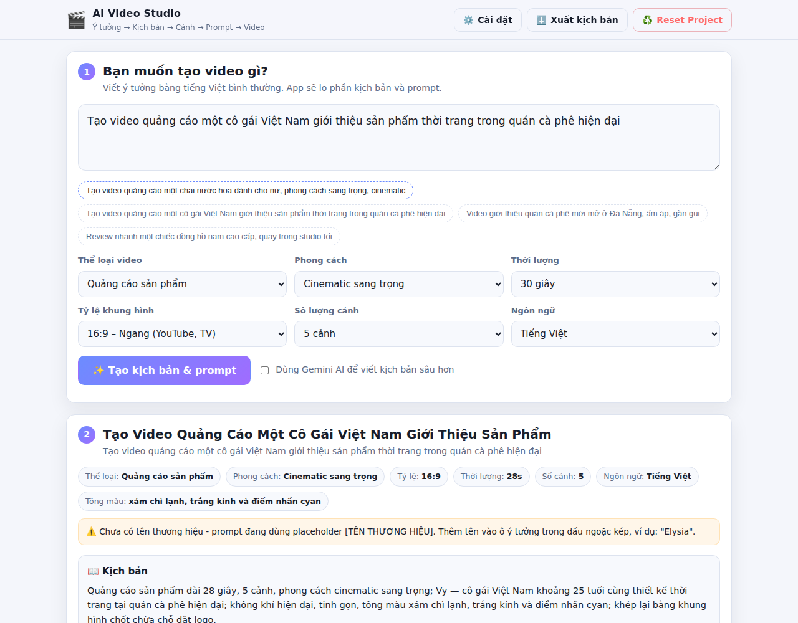

# 🎬 AI Video Studio

App tạo video AI tự động: **nhập một ý tưởng → có ngay kịch bản, danh sách cảnh và bộ prompt hoàn chỉnh để tạo video bằng [Google Flow](https://labs.google/fx/tools/flow)**.

> Ý tưởng → Kịch bản → Chia cảnh → Prompt từng cảnh → Generate → Preview → Regenerate

Không cần build, không cần cài package. Mở `index.html` là chạy.



---

## Chạy app

```bash
git clone https://github.com/Phieu7968/NTL.git
cd NTL
npm start          # mở http://localhost:4173
```

Hoặc mở thẳng `index.html` bằng trình duyệt (Chrome/Edge/Safari đều được).

Chạy test engine:

```bash
npm test           # 28 test, không cần cài dependency
```

---

## Dùng như thế nào

### 1. Nhập ý tưởng
Ô lớn đầu trang: **"Bạn muốn tạo video gì?"**. Viết bằng tiếng Việt bình thường, ví dụ:

> Tạo video quảng cáo một chai nước hoa dành cho nữ, phong cách sang trọng, cinematic

Kèm 6 tuỳ chọn: **Thể loại · Phong cách · Thời lượng · Tỷ lệ khung hình · Số lượng cảnh · Ngôn ngữ**.
Có sẵn 4 ý tưởng mẫu bấm một phát là điền.

### 2. App tự viết kịch bản và chia cảnh
Bấm **"Tạo kịch bản & prompt"**. App phân tích ý tưởng để rút ra nhân vật, sản phẩm, bối cảnh, tâm trạng, tông màu — rồi dựng kịch bản theo cấu trúc kể chuyện của đúng thể loại đó (quảng cáo có hook → khơi gợi → lộ diện sản phẩm → sử dụng → cận cảnh → cảm xúc → CTA).

Mỗi cảnh có: **thời lượng · nội dung · hành động · mô tả hình ảnh · góc máy · chuyển động máy · lời thoại**. Tổng thời lượng các cảnh luôn khớp đúng con số bạn chọn.

Ngay dưới phần tổng quan là khối **📖 Kịch bản**: một đoạn tóm tắt tiếng Việt (thể loại, thời lượng, nhân vật, bối cảnh, không khí, tông màu) kèm **dòng thời gian** từng cảnh — bấm vào mốc nào là nhảy thẳng xuống cảnh đó.

```
Quảng cáo sản phẩm dài 30 giây, 5 cảnh, phong cách cinematic sang trọng; Vy — cô gái
Việt Nam khoảng 25 tuổi cùng thiết kế thời trang tại quán cà phê hiện đại; không khí
hiện đại, tinh gọn, tông màu xám chì lạnh, trắng kính và điểm nhấn cyan; khép lại bằng
khung hình chốt chừa chỗ đặt logo.

00:00 – 00:06  Macro chi tiết      Scene 1: Mở đầu gây chú ý
00:06 – 00:12  Trung cảnh          Scene 2: Khơi gợi mong muốn
00:12 – 00:19  Trung cảnh          Scene 3: Sản phẩm trong sử dụng
00:19 – 00:25  Đặc tả gương mặt    Scene 4: Cao trào cảm xúc
00:25 – 00:30  Toàn cảnh           Scene 5: Chốt & kêu gọi hành động
```

### 3. Prompt chi tiết cho từng cảnh
Mỗi cảnh được biên dịch thành một prompt đầy đủ cho Flow/Veo:

```
Scene 3/5 - "Sản phẩm trong sử dụng" - 7s - 9:16

Subject: VY (25-year-old Vietnamese young woman), long straight black hair, natural
  glowing skin, soft natural makeup, wearing a minimalist cream silk blouse and
  tailored trousers, same face, same hairstyle and same outfit in every shot.
Product (must stay identical): the hero fashion outfit, soft flowing fabric with
  visible weave and stitching, exactly the same shape, colour, label and proportions.
Action: VY wears the fashion outfit and turns slowly so the fabric catches the light.
Setting: a modern coffee shop with warm wood tables, hanging pendant lights, ...
Camera: medium shot, eye-level angle, gentle handheld float, 35mm lens, shallow DOF.
Lighting: clean broad softbox light with cool edge highlights.
Look: luxury cinematic, anamorphic flares, filmic grain, colour palette of ...
Audio: minimal electronic pulse, clean UI clicks, airy pad.
Dialogue (Vietnamese, lip-synced): "Chỉ một chạm, mọi thứ khác hẳn."
Continuity: VY keeps the exact same face, hair and outfit as every other scene; ...
Negative prompt: no extra fingers, no deformed hands or faces, no warped label, ...
```

### 4. Tạo video
- **🎬 Generate Video — tất cả cảnh**: copy toàn bộ prompt và mở Google Flow.
- **🎬 Generate Scene N** ở từng thẻ cảnh: mở quy trình 6 bước cho riêng cảnh đó, prompt đã nằm sẵn trong clipboard.
- Tải video từ Flow về rồi bấm **📁 Gắn video** (hoặc dán link) — video hiện ngay trong app để preview.
- Có Gemini API key thì bật chế độ **Veo qua Gemini API** trong ⚙️ Cài đặt để render thẳng trong app, khỏi thao tác tay.

### 5. Chỉnh sửa từng cảnh mà không phá các cảnh khác
Đây là điểm quan trọng nhất của app:

- Sửa hành động / góc máy / lời thoại / thời lượng của một cảnh → **chỉ cảnh đó đổi**.
- Viết đè hẳn prompt của một cảnh → cảnh đó dùng bản của bạn, các cảnh khác không đụng tới, và có nút **↩︎ Về prompt gốc** để hoàn tác.
- **🔁 Regenerate prompt** một cảnh → cảnh đó có góc máy/hành động mới, **nhân vật và sản phẩm vẫn y hệt** các cảnh còn lại, video của các cảnh khác vẫn còn nguyên.
- Muốn đổi nhân vật hoặc sản phẩm cho **cả video**: mở panel *🔒 Nhân vật & sản phẩm* rồi bấm "Áp dụng cho tất cả cảnh".

### 6. Quản lý dự án
Giao diện đi đúng thứ tự **Ý tưởng → Kịch bản → Danh sách Scene → Prompt → Video Preview**, mỗi cảnh có hàng nút `Copy prompt | Generate | Preview | Regenerate | Gắn video`.
Dự án tự lưu vào trình duyệt (đóng tab mở lại vẫn còn, video đã gắn cũng còn), có thanh tiến độ, nút **Xuất kịch bản** ra file `.md` và nút **Reset Project**.

---

## Vì sao nhân vật và sản phẩm không bao giờ lệch giữa các cảnh

App giữ một **Project Bible** — nguồn sự thật duy nhất về nhân vật, sản phẩm, bối cảnh, ánh sáng, tông màu, âm thanh:

```
Ý tưởng ──► Project Bible ──┬──► Scene 1 ──► Prompt 1
            (khoá nhân vật  ├──► Scene 2 ──► Prompt 2
             + sản phẩm)    └──► Scene N ──► Prompt N
```

Prompt của mọi cảnh đều được **biên dịch lại từ đúng object đó**, kèm một dòng `Continuity:` nhắc model giữ nguyên khuôn mặt, tóc, trang phục và hình dáng sản phẩm. Vì thế:

- sửa một cảnh không thể làm lệch nhân vật ở cảnh khác — cảnh khác không hề được biên dịch lại;
- regenerate một cảnh chỉ đổi góc máy/hành động, phần khoá lấy nguyên từ bible;
- đổi bible thì tất cả cảnh cập nhật cùng lúc, trừ những cảnh bạn đã tự viết prompt riêng.

Điều này được khoá bằng test (`tests/engine.test.js`), không chỉ là quy ước.

---

## Cấu trúc mã nguồn

```
index.html               giao diện (1 trang, không framework)
styles.css               responsive desktop + mobile, tự theo dark/light của máy
src/
  app.js                 lớp UI: sự kiện, render, modal, tiến độ
  storage.js             lưu dự án (localStorage) + video (IndexedDB)
  engine/                logic thuần, chạy được trên Node nên test được
    presets.js           thể loại, phong cách, tỷ lệ, ngôn ngữ
    text.js              bỏ dấu tiếng Việt, seed, PRNG tái lập
    bible.js             phân tích ý tưởng → Project Bible (nhân vật/sản phẩm/bối cảnh)
    script.js            beat kể chuyện theo thể loại → danh sách cảnh + thời lượng
    synopsis.js          tóm tắt kịch bản tiếng Việt + dòng thời gian
    prompt.js            biên dịch prompt hoàn chỉnh cho Flow/Veo
    project.js           thao tác dự án: sửa/regenerate/gắn video từng cảnh
  providers/
    flow.js              quy trình Google Flow (copy prompt, mở Flow, gắn video)
    gemini.js            tuỳ chọn: Gemini viết kịch bản + Veo render video
tests/engine.test.js     28 test cho toàn bộ engine
```

---

## Về API key (không bắt buộc)

App chạy **đầy đủ mà không cần key**: kịch bản do engine trong máy sinh, video tạo qua Google Flow.

Nhập Gemini API key ở ⚙️ Cài đặt nếu muốn:
- **Gemini viết kịch bản** sâu hơn (AI chỉ viết hành động + lời thoại, phần khoá nhân vật/sản phẩm vẫn do bible quyết định nên không bị lệch);
- **Veo render video** ngay trong app.

Key chỉ nằm trong `localStorage` của trình duyệt bạn và chỉ được gửi tới Google. Google Flow hiện chưa có API công khai nên phần Flow là bán tự động: app chuẩn bị prompt, bạn dán vào Flow, tải video về rồi gắn ngược lại.

## Giấy phép

MIT
